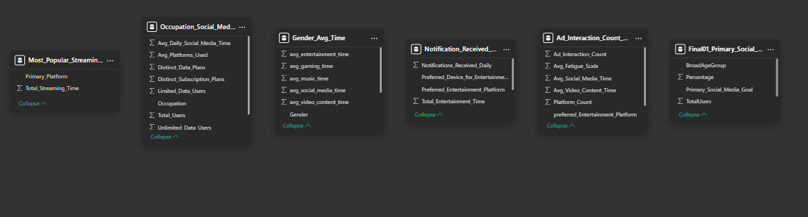
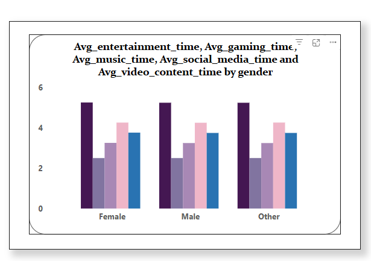
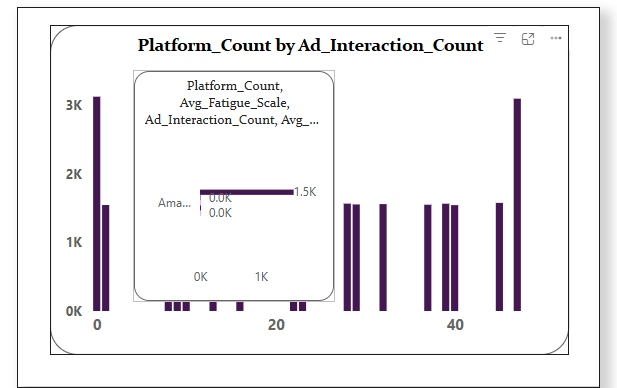
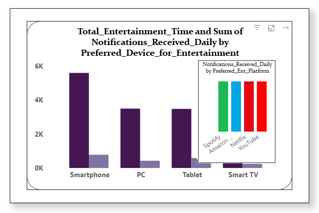
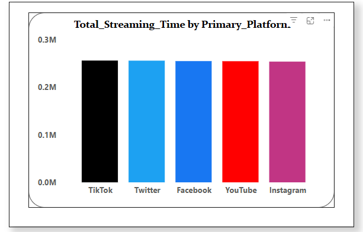
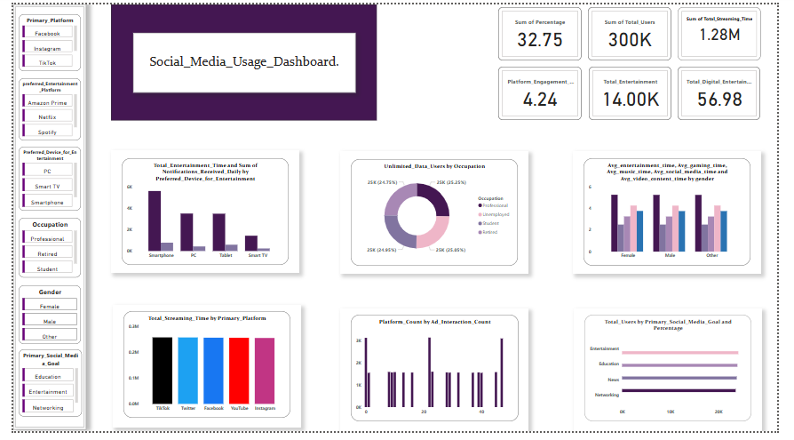

# Social_Media_Usage.
Analysis of Social Media Usage pattern.

# Introduction.
This project presents a detailed analysis and visualization of **Social Media Usage** patterns across different platforms and user demographics. The dashboard provides insights into entertainment consumption, platform engagement, and user behavior metrics.

## Project Overview.
The dashboard summarizes and visualizes key metrics which include:
 * Platform usage across primary social media networks (Facebook, Twitter, YouTube, Instagram)
 * Entertainment consumption patterns across devices (Smartphone, PC, Tablet, Smart TV)
 * User demographics categorized by occupation and gender.
 * Platform engagement metrics with total users reaching 1.28M.
 * Entertainment consumption metrics showing 300K total users and 32.75% overall engagement rate.
 * Digital platform engagement score of 56.98 with 14K total entertainment interactions.
This static dashboard serves as a focused analytical tool that displays specific metrics to understand user behavior, platform preferences, and content consumption patterns across different demographic segments. Through its targeted visualizations, the dashboard presents clear insights that can be valuable for digital marketers, content strategists, and business analysts in formulating data-driven **Social Media Strategies**.

## Software & Platforms.
 * Data Cleaning: SQL.
 * Data Analysis: SQL, DAX Measure.
 * Data Visualization: Power BI.

_**Discliamer**_ : _This project and all associated data, visualizations, and analyses are intended for demonstration and educational purposes only_.

_**Important Note**_ ⚠️
 * _This is a mock dataset that does not represent actual user behavior, demographics, or usage patterns from any real social media platforms_.
 * _The analysis, metrics, and insights presented do not reflect real-world social media statistics or trends_.
 * _Any similarities to actual social media platforms, user behaviors, or demographic patterns are purely coincidental_.
 * _The data patterns, user segments, and engagement metrics are simulated for learning and demonstration purposes_.
 * _This project should not be used as a basis for real-world business decisions or market analysis_.
 * _The visualizations and insights are exercises in data analysis techniques and dashboard creation_.
 * _No real user data, personal information, or platform-specific data was used in this analysis_.

## Problem Statement.❗
In today's digital world, social media platforms struggle to optimize user engagement, content delivery, and features due to a lack of clear insights into user behavior and preferences. This project aims to address several key questions:
 * How can platforms optimize content delivery for maximum engagement?
 * What factors drive user retention across different demographics?
 * How can ad delivery be improved based on user interaction patterns?
 * What features should be prioritized for different user segments?
 * How can the multi-platform experience be enhanced?

## Modelling.

This data model is designed as a flat denormalized structure where each table contains independent metrics and dimensions for specific analysis purposes:
1. Each table serves a distinct analytical function:
 * Most_Popular_Streaming: Streaming metrics.
 * Gender_Avg_Time: Gender-based time analysis.
 * Ad_Interaction_Count: Advertisement metrics.
 * Notification_Received: Notification patterns.
 * Final_Primary_Social: Social media goals.
2. The tables contain pre-aggregated data (indicated by column names with "Avg_", "Total_", "Count_"), suggesting the data has already been transformed and summarized at the desired level of analysis.
3. The purpose is standalone reporting rather than transactional analysis, eliminating the need for traditional star or snowflake schema relationships.
4. Each table serves as a direct data source for specific visualizations in the dashboard, functioning independently to tell different parts of the overall story.

## Visualization.👓
The **Social Media Usage** analysis is presented through seven key visualizations, each providing unique insights into user behavior, platform performance, and engagement patterns.

## Detailed Visualization Analysis.
1. _**Average Time Distribution by Gender**_.
 * Visualization Type: Grouped Bar Chart.
 * Metrics Displayed: Average entertainment, gaming, music, social media, and video content time.

 *Key Findings:
  * Noticeable similar usage patterns across all categories.
  * Entertainment has highest engagement (≈5.25 hours).
  * Gaming shows lowest engagement (2.50 hours).
  * Social media is second most popular activity (≈4.25 hours).

### Recommendations:
A. Content Strategy: Develop gender_neutral content strategies and focus on high engagement content.

B. Platform Development: Design features that appeal to both genders and create integrated entertainment and social experiences.

C. User Experience: Ensure seamless transition between different types of content.

D. Marketting Approach: Use interest-based and behavioural targeting,and develop univerally appaealimg campaigns.

E. Business Development: Invest equally in entertainment and social media features, and explore cross-platform entertainment partnerships.

2. _**Platform and Ad. Interaction Analysis**_.
 * Visualization Type: Bar chart with embeded Tooltip.
 * Metrics Displayed: Platform count versus ad interaction frequency.

*Key Findings:
 * Certain ad interaction counts show higher platform counts, indicating that these levels are more engaging for users.
   
 * The chart helps identify the optimal ad interaction counts that maximize platform engagement.
   
 * Analyzing the average fatigue scale alongside platform counts reveals how user fatigue impacts engagement.
   
 * The chart provides insights into platform-specific performance, helping identify which platforms perform best at different ad interaction levels.

### Recommendations:
 * Identify the optimal range of Ad_Interaction_Count where user engagement is highest.
   
 * Reduce ad exposure in ranges where engagement declines to prevent ad fatigue and optimize spend.
   
 * For users with low ad interactions, use awareness-focused ads.
   
 * For users with high interactions, test retargeting campaigns with different messaging to prevent fatigue.
   
 * If different platforms show varying engagement levels, shift budgets to platforms where higher interactions positively impact engagement.
   
 * Platforms showing fatigue or low effectiveness should be optimized or reconsidered.
   
 * Conduct surveys or analyze user behavior to understand why engagement suddenly drops.
   
 * If high engagement occurs at specific interaction counts, segment users accordingly.
   
 * Adjust ad delivery frequency and messaging based on user behavior patterns.

3. _**Device Preference Analysis**_.
  * Visualization Type: Clustered column Chart with Secondary Visualization.
  * Metrics Tracked:
    * Device total entertainment time.
    * Daily notification pattern on preferred entertainment platform.

  *Key Findings:
   * Smartphones have the highest total entertainment time, significantly higher than other devices (PC, Tablet, Smart TV).

   * Users prefer consuming entertainment on mobile devices, possibly due to convenience and portability.

   * Entertainment time on PCs and Tablets is noticeably lower than on smartphones but still significant.

   * This suggests that while people use these devices for entertainment, they may be secondary choices.

   * The lowest entertainment time is recorded on Smart TVs, meaning fewer users rely on them for daily entertainment.

   * This could indicate a shift toward on-the-go entertainment rather than traditional TV consumption.

   * The tooltip shows that Spotify, Amazon, Netflix, and YouTube notifications are nearly equal across platforms.

   * This suggests that notifications are not device-specific but rather content/service-driven.

   ### Recommendations:
   * Optimize content for mobile users since smartphones lead in entertainment time.
    
   * Short-form videos, mobile gaming, and bite-sized content should be the focus.
    
   * Ensure streaming apps and websites are mobile-friendly for a better user experience.

   * Since PC and Tablet usage is moderate, enable seamless content switching between devices.

   * Features like "Continue Watching" or syncing across devices can boost engagement.

   *  If Smart TV engagement is low, introduce personalized recommendations or interactive features to increase usage.

   *  Increase marketing efforts for premium long-form content (movies, series, live sports).

   *  Since notifications are evenly distributed, analyze which notifications drive the most user engagement.

   *   Reduce notification fatigue by limiting unimportant alerts while enhancing personalized suggestions.

   *   Mobile-first ad campaigns should be prioritized, as users spend the most time there.

   *   Offer subscription models, in-app purchases, and premium ad-free experiences for mobile users.

4. _**Platform Streaming Analysis**_
   * Visualization Type: Stacked column chart.
   * Metrics Tracked: Total streaming time across platforms.

 

   * Key findings:
      * The total streaming time appears to be fairly evenly distributed among TikTok, Twitter, Facebook, YouTube, and Instagram.
    
      * No single platform significantly outperforms the others in terms of total streaming time.
    
      * Users seem to engage with content similarly across different social media platforms.
    
      * The streaming audience is fragmented, meaning users divide their time across multiple platforms rather than focusing on just one.

5. _**Social Media Usage Dashboard**_

    
   
   This provides insights into user engagement with different social media platforms, entertainment preferences, and demographic distributions.
   
   * Key Findings:
    * Total Users: 300k.
      
    * Total Streaming Time: 1.28M
      
    * Total Engagement:  4.24.
      
    * Total Entertainment Users: 14k.
      
    * Total Digital Entertainment Usage: 56.98.
  
   * User Demographics & Preferences:

      * Primary Platforms: Facebook, Instagram, TikTok.
    
      * Preferred Entertainment Platforms: Amazon Prime, Netflix, Spotify.
    
      * Preferred Devices for Entertainment: Smartphone, PC, Tablet, Smart TV.
    
      * Occupations of Users: Professional, Student, Retired.
    
      * Gender Distribution: Male, Female, Other.
    
      * Social Media Goals: Education, Entertainment, Networking.
    
    * Visual Data Representation:
  
    * Streaming Time by Platform: TikTok, Twitter, Facebook, YouTube, Instagram have varying levels of engagement.
     
    * Entertainment Usage by Device: Smartphones and PCs dominate, while tablets and Smart TVs have lower engagement
     
    * User Distribution by Occupation: Professionals, students, and retired users form the majority.
     
    * Engagement by Gender: Males and females show different usage patterns for gaming, entertainment, and video content.
     
      * Ad Interaction by Platform: Different platforms have varying levels of ad interactions.

    Kindly click on []{<iframe title="Social_Media_Usage_Dashboard." width="600" height="373.5" src="https://app.powerbi.com/view?r=eyJrIjoiYWYwYzAwNmEtMGEzZS00ZWMxLTljMzEtYTliZTFlMzQ5OGQ0IiwidCI6ImM0MDM2NzBlLWE0YjEtNDkzNy1hMWU2LWIwOWRlNTk3ZDYzMiJ9" frameborder="0" allowFullScreen="true"></iframe>) to interact with the dashboard.

   ### Conclusion: 

   The analysis of the Social Media Usage dataset reveals significant variations in ad interactions across major platforms, with TikTok, Facebook, and Instagram emerging as leaders in 
   user engagement. These insights underscore the diverse and dynamic nature of the digital advertising landscape, emphasizing the importance of platform-specific strategies. By 
   understanding trends in user behavior, platform preferences, and demographic influences, businesses can optimize ad placement and allocate marketing resources more effectively. 
   Ultimately, this dataset provides critical insights for shaping targeted marketing strategies, informing policy decisions, and addressing the broader societal impact of social media 
   in an increasingly digital world.
     
 

   

   
   

    

 
 
    
    

   

   
